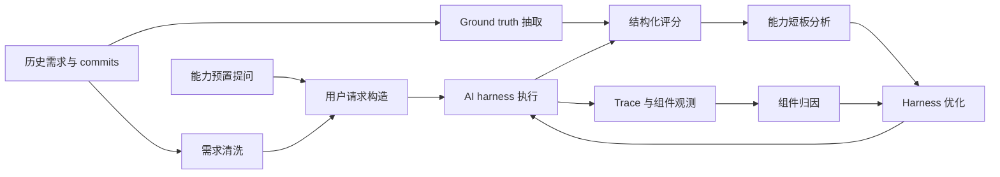

# 面向企业闭源代码库的 AI Benchmark 与 EvoBench 方案

## 摘要

随着大语言模型和 AI Agent 在软件工程场景中的快速发展，Requirement-to-Code（R2C）正在成为企业内部提升研发效率的重要方向。然而，在企业闭源代码库场景下，AI 辅助代码开发并不能简单复用开源社区中的通用模型、通用 benchmark 或通用 Agent 方案。一方面，企业内部通常受到算力、成本、部署形态和数据安全要求的约束，难以直接使用最先进的 SOTA 模型与商业 Agent 系统；另一方面，闭源代码库长期积累了大量架构知识、接口约束、运行时约束和工程惯例，外部模型天然缺乏这些知识，导致其在真实研发任务中容易出现理解偏差、影响范围判断不足、方案设计不符合系统边界、代码实现难以通过构建和测试等问题。

EvoBench 的目标是在企业闭源代码库场景下构建一套领域特定、可量化、可复现、可归因的 AI benchmark。当前阶段以闭源微内核操作系统为目标领域，重点评估 AI 辅助代码开发过程中的基线代码库知识理解能力、需求理解能力、影响分析能力、方案设计能力和代码开发能力。后续可沿用同一数据集构造方法，扩展到闭源编译器、闭源数据库等复杂系统软件领域。该方案的核心洞察是：已经完成开发并合入的历史需求天然具备 ground truth。通过从历史需求中提取不泄露实现细节的需求描述，组合能力子项对应的预置提问，形成待评测用户请求，并从真实 commits、代码差异、接口变更、测试和专家标注中抽取结构化 ground truth，可以构造出面向真实工程能力的高质量 benchmark 数据集。

## 1. 研究背景

AI 辅助代码开发已经从单点代码补全逐步演进到面向完整研发流程的 Agent 化协作。典型流程不再只要求模型生成局部函数，而是要求 AI harness 能够阅读项目文档、理解代码库结构、定位相关模块、分析需求影响、提出设计方案、修改代码、执行构建测试，并在失败后进行调试和迭代。对于企业内部正在探索的 R2C 场景而言，目标也不只是提升代码生成速度，而是希望 AI 能够在既有大型工程约束下完成从需求到可合入代码的闭环。

然而，企业闭源代码库与开源通用代码生成场景存在显著差异。闭源系统软件通常具备长期演化形成的模块边界、接口契约、资源管理模型、并发约束、权限模型、错误处理惯例和构建部署规则。微内核操作系统、编译器、数据库等领域还具有更强的系统级语义：一次需求变更可能跨越内核对象、IPC、调度、内存、驱动、构建配置、用户态组件和测试框架等多个层次。AI 如果缺乏对基线代码库的充分理解，即使具备较强的通用编程能力，也难以在此类场景中稳定产生高质量结果。

因此，企业需要一种不同于通用代码 benchmark 的评测体系。该体系需要围绕真实闭源代码库、真实历史需求和真实工程约束设计，不仅评估模型或 Agent 是否能“写代码”，还要评估其是否真正理解代码库、是否正确把握需求边界、是否能够预判改动影响、是否能够提出符合架构约束的方案，以及最终代码是否能够满足构建、测试、兼容性和可维护性要求。

## 2. 当前痛点

### 2.1 企业内部 AI 能力受限

企业内部部署 AI 辅助开发系统时，通常面临算力、成本、网络隔离、数据安全和合规要求等约束。相比开放互联网环境，内部系统未必能够持续使用最新 SOTA 模型，也未必能够直接接入外部商业 Agent 平台。因此，企业实际可用的 AI harness 往往是模型、提示词、工具、插件、上下文管理、权限策略和多 Agent 协作机制的组合系统，其能力上限不仅取决于模型本身，也取决于工程化 harness 的整体设计。

在这种条件下，单纯追求模型规模或模型排行榜分数并不足以指导内部 R2C 能力建设。企业更需要知道：在现有模型能力受限的条件下，harness 的哪些组件能够补偿模型短板，哪些组件正在放大错误，哪些能力瓶颈最影响真实研发任务完成率，以及优化某个组件是否能够稳定提升端到端效果。

### 2.2 AI 缺乏闭源代码库知识

开源 benchmark 通常基于公开代码、公开 issue 或公开测试集构造，模型可能在预训练或指令调优过程中间接接触过相关知识。闭源代码库则不存在这样的先验优势。对于闭源微内核操作系统而言，关键知识包括模块职责、运行时入口、IPC 通路、内核对象生命周期、权限检查链路、错误码语义、并发与锁约束、资源释放时机、构建配置关系等。这些知识往往分散在代码、头文件、构建脚本、测试、设计文档和历史提交中。

AI harness 如果不能主动、准确、充分地获取这些知识，就容易出现以下问题：定位错误模块或文件；误判接口职责；忽略调用链上的关键条件；遗漏状态迁移或资源释放路径；破坏已有分层边界；生成不符合本项目风格和约束的代码。这类问题并非单纯依靠更强的局部代码补全即可解决，而需要系统地评估和优化代码库理解能力。

### 2.3 缺少可靠、可复现的内部评测基准

在企业内部 AI 辅助开发实践中，常见评估方式包括人工试用、单个 demo、少量人工挑选任务或根据最终生成代码主观打分。这类方式具有较强偶然性，难以支持 harness 版本之间的稳定比较，也难以对具体能力短板进行量化分析。对于复杂系统软件，端到端结果失败也并不直接说明失败原因：可能是需求理解错误，可能是代码库知识不足，可能是影响分析缺失，也可能是工具调用、上下文压缩、权限机制或模型调用策略存在问题。

因此，benchmark 需要同时满足四类要求：其一，评测任务应来自真实研发过程，能够代表目标领域的真实工程难度；其二，ground truth 应有可靠来源，避免完全依赖评审者主观判断；其三，问题与答案应尽可能结构化，便于自动化或半自动化评分；其四，评测过程应可重复，能够对 harness 版本迭代形成稳定反馈。

### 2.4 业界 benchmark 仍以端到端补丁生成或任务完成为主

从公开研究和产业实践看，AI coding benchmark 大体经历了几个阶段。早期 HumanEval、MBPP、APPS、CodeContests 等主要评估函数级代码生成或算法题求解能力，输入通常是题目描述或函数签名，输出是局部代码。随后，RepoBench、CrossCodeEval 等工作开始关注仓库级上下文，评估跨文件检索、代码补全和上下文利用能力。再之后，SWE-bench 将评测推进到真实 GitHub issue 级别：给定代码库快照和 issue 描述，要求模型或 Agent 修改代码库并生成 patch，由 FAIL_TO_PASS 和 PASS_TO_PASS 测试判断是否解决问题。SWE-bench Verified 进一步通过专家标注筛选出 500 个更清晰、理论上可解的样本，但 OpenAI 在 2026 年的复盘中已指出该集合存在测试质量与训练污染问题，不再建议将其作为前沿代码能力的主要度量。SWE-bench Multimodal 扩展到带视觉信息的前端和可视化库任务；SWE-bench Live 通过月度更新、更多语言和 Windows 任务缓解公开静态数据集的污染与覆盖不足；SWE-Lancer 则引入来自真实自由职业平台的软件工程任务和管理决策任务，以端到端测试或原始管理选择进行判定。

上述 benchmark 显著提升了 AI 代码能力评测的真实性，但其核心评价对象仍主要是“给定问题描述和代码库后，最终能否产出可通过测试或被接受的结果”。这类设置适合衡量 issue resolving、bug fixing、repository-level patch generation 或 freelance task completion，却难以细粒度评估企业 R2C 流程中的多个关键阶段。例如，真实内部研发通常包含需求澄清、需求边界确认、基线代码库理解、影响范围分析、方案设计、代码开发、编译调测、回归验证和评审反馈处理等环节。端到端通过率只能说明最终任务是否成功，无法稳定区分失败究竟来自需求误解、代码库知识缺失、方案设计不合理、工具探索不足、编译调测能力弱，还是测试利用策略存在缺陷。

因此，EvoBench 需要在端到端评测之外显式构造分阶段、分能力、可归因的评估体系。它不仅关注最终 patch 是否正确，还要通过 T1 至 T5 的能力矩阵分别评估代码库知识理解、需求理解、影响分析、方案设计和代码开发能力，使 benchmark 结果能够直接服务于 harness 工程优化。

### 2.5 内外部通用 benchmark 难以契合闭源专用领域需求

公开 benchmark 主要来自开源项目、公开 issue、公开 PR、公开测试集或公开竞赛题。这些数据集具有可复现、可比较和便于社区协作的优势，但也天然存在领域分布差异和数据污染风险。以 SWE-bench 为例，其原始任务来自 12 个开源 Python 仓库；SWE-bench Live 虽然扩展到更多仓库、语言和操作系统，但仍以公开 GitHub 活动为主要来源。此类数据能够衡量通用软件工程能力，却难以代表闭源微内核操作系统中的内核对象、IPC、调度、权限、驱动、资源生命周期、并发同步和系统级构建约束。

内部已有 benchmark 或人工评测集也可能存在类似问题。例如从模型网关采集的数据完受限于用户的具体请求和数据清洗能力，难以针对某一特定领域或内部组件构造充分的测试集。对于后续可能扩展的闭源编译器、闭源数据库等领域，问题同样存在：这些系统各自拥有专用抽象、专用术语、专用测试方式和专用质量风险，不能简单用一个外部通用 leaderboard 分数推断企业内部 R2C 效果。

因此，EvoBench 的定位不是替代通用公开 benchmark，而是补足其在企业闭源专用领域中的空白。公开 benchmark 可用于观察模型或 Agent 的通用能力趋势；EvoBench 则用于衡量 harness 在指定闭源代码库、指定领域知识和指定研发流程中的真实有效性。

### 2.6 缺少从评测结果到 harness 优化的归因机制

端到端 benchmark 可以回答“当前 harness 做得好不好”，但不能自动回答“为什么不好”。在 Agent 化研发系统中，一次失败可能由多个组件共同造成：CLI 层传入的任务信息不完整，System Prompt 没有强调关键约束，Session/runLoop 没有形成合理探索路径，工具注册和 MCP 能力不可见，LLM Provider 输出不稳定，上下文压缩丢失关键文件，子 Agent 拆分粒度不当，权限系统阻断必要命令，或者最终响应未忠实反映实际代码证据。

因此，EvoBench 不应只是静态 benchmark 数据集，还需要作为 harness 自进化的观测基准和反馈源。只有将 benchmark 分数、执行 trace、组件输入输出和中间行为评估结合起来，才能把能力得分下降进一步映射到具体组件、具体行为模式和具体优化方向。

## 3. 研究目标

EvoBench 的总体目标是构建一个面向企业闭源代码库的 AI benchmark 与自进化评估框架。当前目标领域为闭源微内核操作系统，后续可复用方法扩展到闭源编译器、闭源数据库及其他复杂基础软件。该目标包含三个层次。

第一，构建领域特定 benchmark 数据集。数据集应围绕目标闭源代码库和真实历史需求构造，评估 AI harness 在该领域完成研发任务所需的关键能力。数据集本身是专用的，因为不同领域的模块结构、接口语义和工程约束不同；但数据集构造过程应具有通用性，即可以迁移到其他闭源系统软件。

第二，建立可量化能力评估体系。评测对象不是单个模型，而是包含模型、Agent 编排、工具系统、上下文管理、权限机制、插件和多 Agent 协作在内的 AI harness。评测应给出端到端分数，也应给出按能力维度拆分的分数，例如代码库理解、需求理解、影响分析、方案设计和代码实现。

第三，为 harness 自进化提供依据。benchmark 结果需要能够被反复运行、横向比较和纵向跟踪，并与 trace 观测、shadow evaluation、专家归因和组件级优化形成闭环。最终目标是用可靠数据定位薄弱能力和薄弱组件，为 harness 工程改进提供锚点。

## 4. 核心洞察：历史需求天然具备 Ground Truth

传统软件工程 benchmark 的核心难点之一是 ground truth 构造成本高。若人工编写需求、实现和评分标准，不仅成本高，而且难以覆盖真实工程复杂性。EvoBench 采用不同思路：从已经完成开发并合入代码库的历史需求中构造 benchmark。

对于一个历史功能需求，可以将其拆解为三类信息。

第一类是 AI 可见信息，即经过清洗的需求描述。该描述应保留需求目标、业务或系统语义、必要约束和非目标范围，但不泄露具体实现细节，例如具体函数名、精确文件路径、内部接口编号、提交哈希或实现算法。

第二类是待评测能力对应的预置提问。预置提问与具体需求描述解耦，用于引导 AI harness 展示某项能力。例如，在评估基线代码库知识理解能力时，预置提问可以要求 AI 识别相关模块职责、接口契约、调用链、状态迁移、资源生命周期或边界约束。通过将“需求描述”和“预置提问”组合，可以形成具体测试点。

第三类是私有 ground truth。ground truth 来自真实已合入实现，包括 commits、代码 diff、修改文件、接口变更、测试用例、设计文档和专家补充标注。对于代码库理解类任务，ground truth 可以进一步结构化为实体列表、文件路径、符号、模块层级、关系边、调用顺序、生命周期阶段、负例和别名等，从而支持稳定评分。

这一机制的关键价值在于：历史需求提供了真实工程分布，真实实现提供了可靠答案来源，需求清洗保证了评测信息不泄露，预置提问保证了能力维度可控，结构化 ground truth 保证了评分可重复。

## 5. Benchmark 数据集构造流程

EvoBench 的数据集构造流程可以抽象为“基线选择、需求筛选、输入清洗、问题组合、答案抽取、质量控制”六个步骤。

### 5.1 基线代码库选择

首先选择一个稳定的历史版本作为基线代码库。AI harness 在评测时只能看到该基线代码库及其公开给评测对象的文档、构建脚本和测试设施，不能看到后续真实实现。基线版本之后发生的功能提交、需求文档和测试变化则作为候选数据来源。

基线选择需要满足两个条件：一是该版本具有完整构建和基本测试能力，能够支持 AI harness 进行真实代码探索；二是基线之后存在足够数量、边界相对清晰的历史需求，以便构造覆盖不同能力和难度层级的数据集。

### 5.2 历史需求与功能提交筛选

候选需求应来自真实研发过程中的功能开发、接口扩展、行为变更或系统能力增强。优先选择具备明确需求描述、完整代码实现、可追溯提交记录和测试验证的任务。对于过于耦合、缺少需求来源、实现分散且难以归因、包含高度敏感信息或无法建立可靠 ground truth 的任务，应从首轮数据集中剔除。

在闭源微内核操作系统场景中，候选需求可以覆盖内核对象管理、IPC、调度、权限、驱动框架、用户态服务、构建配置、错误处理、测试工具等方向。筛选时需要确保任务既具有代表性，又不会因单个需求过大而导致评分标准不可控。

### 5.3 需求描述清洗

需求描述清洗的目标是在保留语义的同时消除实现泄露。清洗后的需求描述应说明需求目标、适用场景、约束条件、兼容性要求、必须支持的行为和明确不属于本次需求的范围。它不应直接暴露真实修改文件、函数名、内部数据结构名称、精确调用链、提交编号或测试答案。

需求清洗本质上构造了一个受控的信息不对称环境：AI harness 拥有真实研发时合理可获得的需求信息和基线代码库，但没有后续实现。该环境更接近真实 R2C 场景，也能减少 benchmark 被实现细节污染的风险。

### 5.4 预置提问设计

预置提问用于指定评测能力和输出形式。它应与具体需求描述解耦，以便同一类问题可以搭配多个需求使用。当前 T1 基线代码库知识理解能力已经采用 schema-first 的结构化问题设计：每个问题包含能力子项、覆盖标签、详细问题描述、输出要求、响应 schema、oracle schema 和评分 profile。

这种设计有三个优势。首先，详细问题描述能够减少被测 AI 对任务意图的误解，提高数据集质量。其次，结构化响应便于与结构化 ground truth 进行语义相似性比对和自动化评分。再次，coverage tags 可以显式记录每个问题覆盖哪些知识点，避免问题数量受固定配额限制，而是根据能力覆盖充分性决定。

### 5.5 Ground Truth 抽取与结构化

ground truth 不应只保存最终代码 diff，而应根据评测能力拆解为可评分事实。对于代码库理解任务，可以抽取模块、路径、符号、接口、配置项、状态、错误码、资源、锁、调用关系、数据流关系、生命周期阶段、边界约束和反例。对于需求理解任务，可以抽取目标、约束、非目标、兼容性要求和验收条件。对于影响分析和方案设计任务，可以抽取受影响模块、接口变更、设计决策、风险和测试策略。对于代码开发任务，可以抽取必要代码变化、构建结果、测试结果和行为等价标准。

为降低自然语言评分的不确定性，ground truth 应尽可能采用结构化格式。评分时可以综合使用实体召回、实体精确率、分类准确率、关系匹配、顺序匹配、证据质量、负例识别和语义等价判断。对于无法完全自动判定的部分，应保留专家复核入口。

### 5.6 质量控制与安全约束

高质量 benchmark 需要控制数据泄露、任务独立性、ground truth 一致性和评分稳定性。每个测试点都应记录可见输入、不可见答案来源、适用能力维度、难度、评分项和排除条件。对于闭源代码库，还需要确保数据集访问权限、评测日志、模型输入和输出均符合安全要求。

同时，数据集应支持重复运行。不同 harness 版本、不同模型配置或不同 Agent 策略在相同任务上运行时，应能够得到可比较的分数。对于随机性较高的 Agent 系统，可以通过固定环境、固定基线、固定问题、记录 trace 和多次运行取统计结果等方式提高评测可靠性。

## 6. 能力评估体系

EvoBench 的能力矩阵围绕 AI 辅助代码开发的关键阶段展开。当前重点包括 T1 至 T5，并保留 T6 作为 harness 自进化相关的元能力评估方向。

| 能力编号 | 能力名称 | 评估重点 |
| --- | --- | --- |
| T1 | 基线代码库知识理解能力 | AI 是否能够基于基线代码库准确理解模块架构、构建配置、接口契约、数据结构、控制流、数据流、分层边界、权限错误处理以及并发资源约束。 |
| T2 | 需求理解能力 | AI 是否能够从需求描述中识别目标、范围、约束、非目标、兼容性要求和验收条件，并避免过度实现或漏解关键语义。 |
| T3 | 需求影响分析能力 | AI 是否能够预测需求可能影响的模块、文件、接口、控制流、数据流、配置、测试和兼容性风险。 |
| T4 | 方案设计能力 | AI 是否能够提出符合代码库架构和系统约束的设计方案，包括职责划分、接口设计、数据与控制流、异常处理、兼容性和测试策略。 |
| T5 | 代码开发能力 | AI 是否能够将方案落实为可构建、可测试、符合项目风格和行为要求的代码变更，并处理构建错误和回归问题。 |
| T6 | Harness 自进化元能力 | AI harness 是否能够基于评测反馈、trace 和诊断结果进行自我分析、策略调整和迭代优化。 |

T1 是当前首批数据集构造的重点。微内核操作系统场景下，T1 进一步细化为九个可量化子项：模块与架构理解、构建配置与运行入口理解、接口契约理解、核心数据结构与状态模型理解、控制流与调用链理解、数据流与资源生命周期理解、职责边界与分层约束理解、权限错误与异常路径理解、并发同步与资源管理理解。每个子项均可通过结构化预置提问和结构化 ground truth 进行评分。

需要特别区分的是，T1 虽然通常会与某个需求描述组合使用，但需求在 T1 中只是代码探索的语义锚点。T1 的评分对象是 baseline 事实，即当前系统中相关模块、接口、调用链、数据结构、生命周期和约束边界是什么。T1 不要求回答为了实现该需求应该改哪些文件、新增哪些接口或引入哪些流程；即使涉及基线缺口，也只描述当前系统缺少什么，而不预测真实改动范围。

T3 则是在 T1 式事实理解基础上的变更影响预测。它要求 AI 进一步判断为了实现需求，哪些模块、文件、接口、配置、测试、控制流和数据流可能需要新增、修改、保持不变或承担兼容性风险。T3 的 ground truth 主要来自真实 feature commits、代码 diff、接口变更、测试变更和专家补充标注。由此，T1 回答“当前是什么”，T3 回答“为了实现需求可能影响什么”。

T2 至 T5 与真实研发流程的后续阶段对应。T2 关注“需求是否被正确理解”，T3 关注“改哪里以及影响什么”，T4 关注“如何在架构约束下设计”，T5 关注“是否最终实现正确代码”。这种分层评估能够避免只看最终代码结果导致的归因困难。例如，一个实现失败的任务可能在 T1 已经误解代码库，也可能 T1 正确但 T3 漏判影响范围，还可能 T4 设计合理但 T5 编码或调试能力不足。分层评分可以为后续 harness 诊断提供更细粒度信号。

## 7. EvoBench 总体方案

EvoBench 不只是一个静态题库，而是面向 AI harness 自进化的评测和诊断系统。其总体方案可以分为三个阶段。

第一阶段是 AI benchmark 构建与能力评分。系统向被测 AI harness 提供基线代码库和用户请求，收集最终回答、代码变更、工具调用、构建测试结果和运行 trace。评分输出包括总体得分、T1 至 T5 分能力得分、每个任务的子项得分、证据质量和 harness 版本信息。

第二阶段是可观测性与归因。EvoBench 需要记录 harness 内部关键组件的输入输出、耗时、状态、上下文和错误信息。典型组件包括 CLI/Server 层、Session/runLoop、System Prompt 组合、ToolRegistry 与 MCP、LLM Provider、工具执行层、权限系统、Plugin hooks、Bus、Sub-agent、上下文压缩和快照机制等。通过 trace 与 shadow evaluation，可以评估意图保持、上下文完整性、提示词结构、工具选择准确率、探索覆盖率、事实准确性、格式遵循度和幻觉率等中间指标。

第三阶段是 harness 自进化。基于 benchmark 分数和组件级诊断结果，系统可以定位能力短板和疑似瓶颈组件，并形成优化建议。例如，T1 得分不足可能与文件搜索策略、上下文压缩、工具可见性或模型事实判断有关；T3 得分不足可能与探索路径、调用链分析能力或子 Agent 分工有关；T5 得分不足可能与工具执行、构建反馈利用或代码生成策略有关。优化后的 harness 再次运行相同 benchmark，以验证改动是否带来稳定提升。

## 8. 当前进展

当前已经针对 T1 基线代码库知识理解能力构造了一批高质量结构化数据集。该批数据集围绕闭源微内核操作系统的基线代码库知识展开，采用 schema-first 的问题设计方式，每个测试点由需求描述和需求无关的预置提问组合而成，并配置相应的响应 schema、oracle schema 和评分 profile。

T1 数据集强调覆盖充分性，而非机械限制每个能力子项的问题数量。也就是说，一个能力子项如果涉及多个有价值的工程问题，例如模块职责、接口契约、调用链、状态转换、生命周期、边界约束、负例判断等，就应构造足够数量的问题进行充分评估。该原则有助于提高 benchmark 的区分度，也便于后续从具体问题类型反推 harness 的薄弱环节。

根据当前规划，预计将在六月中下旬完成第一轮 AI harness 能力评估。第一轮评估的主要目标不是追求一次性给出最终结论，而是建立可靠、可重复的实验流程，验证 T1 数据集的评分稳定性和区分度，初步识别 harness 在基线代码库知识理解方面的薄弱子项，并为后续 T2 至 T5 数据集构造提供经验。

## 9. 预期效果

EvoBench 预期达到四类效果。

第一，建立企业内部 AI 辅助代码开发能力的客观度量。通过真实历史需求和结构化 ground truth，benchmark 能够比主观试用和 demo 更稳定地反映 harness 在目标闭源代码库上的真实能力。

第二，发现 harness 工程中的薄弱能力。分能力评分可以明确回答当前系统是代码库理解不足、需求理解不足、影响分析不足、方案设计不足，还是代码实现与调试不足。这对于内部模型能力有限的场景尤其重要，因为 harness 工程优化需要优先投入到最影响端到端效果的能力环节。

第三，为组件级优化提供证据。通过 trace、shadow evaluation 和后续归因机制，EvoBench 可以将 benchmark 失败案例进一步关联到工具使用、上下文管理、提示词、权限、子 Agent、模型调用或构建测试反馈利用等具体组件，从而避免只根据最终输出猜测问题原因。

第四，形成可迁移的数据集构造方法。闭源微内核操作系统数据集本身是专用的，但“历史需求清洗 + 能力预置提问 + commit ground truth 抽取 + 结构化评分”的流程可以迁移到闭源编译器、闭源数据库等其他基础软件领域。迁移时需要更换领域能力子项、问题模板和 oracle schema，但整体方法保持一致。

## 10. 后续规划

后续工作将围绕“扩展能力覆盖、增强归因能力、支撑 harness 自进化”三个方向推进。

首先，在 T1 数据集稳定后，继续构造 T2 需求理解、T3 影响分析、T4 方案设计和 T5 代码开发数据集。不同能力的数据集应保持统一的任务来源和 ground truth 抽取原则，同时根据能力差异设计不同的结构化响应格式和评分规则。

其次，基于第一轮评测结果，对 harness 工程各组件的输入输出进行可视化。可视化对象包括用户请求进入系统后的表达形式、System Prompt 拼接结果、工具候选集合、文件探索路径、上下文压缩前后内容、子 Agent 任务拆分、LLM 调用输入输出、权限决策、构建测试反馈和最终响应。该能力有助于将“评测失败”转化为可观察的工程事实。

再次，引入多 Agent 专家讨论机制，构建短板问题的归因流程。可以设置不同专家角色分别关注代码库理解、系统软件架构、Agent 行为、工具链、上下文管理和评分一致性。多 Agent 专家讨论不直接替代 ground truth 评分，而是用于分析失败样本、提出候选根因、汇总证据并生成优化建议。归因结果需要结合 trace、shadow evaluation 和必要的消融实验进行校验。
最后，基于诊断结果对 harness 进行迭代优化，并通过 EvoBench 进行回归验证。优化方向可能包括代码搜索策略、结构化阅读流程、上下文压缩策略、系统提示词、工具注册与使用策略、子 Agent 分工、权限交互、构建测试反馈利用和错误恢复机制。每次优化都应通过固定 benchmark 任务集进行验证，避免局部案例优化导致整体能力退化。

## 11. 总结

EvoBench 面向企业闭源代码库中的 AI 辅助代码开发问题，试图回答两个核心问题：第一，当前 AI harness 在真实系统软件研发任务中具备哪些能力、缺失哪些能力；第二，如何将评测结果进一步转化为 harness 工程优化的可执行依据。其关键方法是利用已完成历史需求天然具备 ground truth 的特性，构造由需求描述、能力预置提问和结构化答案组成的高质量 benchmark 数据集，并通过 trace 观测、shadow evaluation 和归因机制形成自进化闭环。

在当前阶段，EvoBench 已优先围绕基线代码库知识理解能力构造 T1 数据集，并计划在六月中下旬完成第一轮 AI harness 能力评估。该评估将为后续需求理解、影响分析、方案设计和代码开发能力的数据集扩展提供基础，也将为企业内部在算力受限、模型能力受限、闭源知识缺失条件下建设可持续演进的 AI 辅助开发系统提供实验依据。
